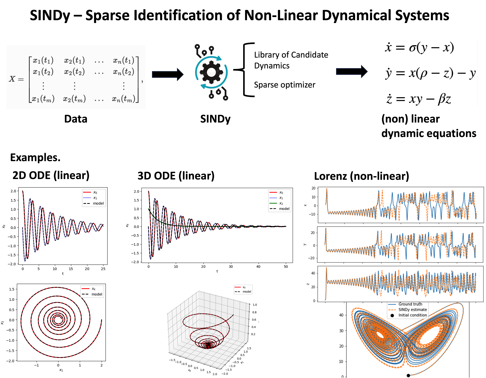
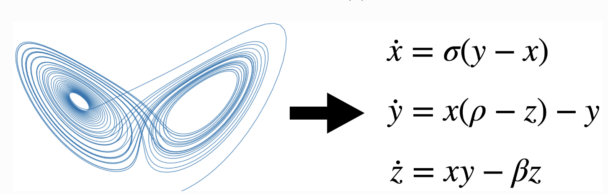
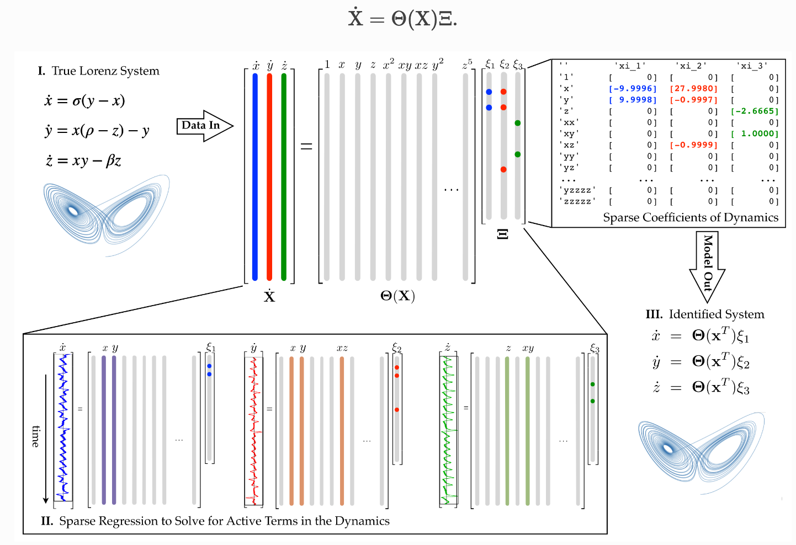

# Sparse Identification of Nonlinear Dynamics (SINDy)

SINDy is a procedure of taking timeseries data and extracting interpretable and generalizable dynamical systems models that describe that data.

Those dynamical system models can take the form of an ordinary differential equation or a partial differential equation

The goal of SINDy is to combine sparsity-promoting techniques and machine learning with nonlinear dynamical systems to discover governing equations from noisy measurement data.

 ## Why Sparcity?

 Why do we want sparsity? Why do we care about having minimalistic simplistic models? *Because there is a need for Interpretable and Generalizable Machine Learning*. Humans need to be able to understand what they mean and they need to generalise outside of the training data where we train them.

 Ultimately, an example of an interpretable and generalizable model is Newton's

 \[ F = m a. \]

This is interpretable in the sense that it has only three terms: $f$, $m$ and $a$, and we can use this model for a problem of interets, analyse, explain and interpret it. This is also generalizable: works for apples falling and spaceships going to the moon. 

In order to do this, we need modes that are simple and by simple we mean that they are low-dimensional (represented by a few variables) and by models that are sparse, that is, models that have as few terms in the dynamical system as are needed to describe the observed dynamics. **This is the philosophy of the SINDy model: we want space models in terms of a few variable!s**. 

## Chaotic Thermal Convection: The Lorenz Attractor

The Lorenz model was defined in 1963 to describe very rich turbulent chaotic convection that we observe in the atmosphere. This model is composed of three equations and a low dimensional states $x$, $y$, and $z$. The states represent the mode amplitudes of three important spatial modes and the dynamics of those three states are described in terms of a very ordinary equation differential equation with seven terms most of them linear, a few of them quadratic.

## SINDy Approach for the Lorenz Attractor

Let's pretend we only have access to data from the Lorenz system. We know that the dynamics are governed by equations, but let's assume that we do not know what they are. 

We just measure $x$, $y$, and $z$, the states of the system in time. This means that every row in our dataset is a measurement in time and we assume that we can compute the derivatives $\dot{x}$, $\dot{y}$, and $\dot{z}$. This is a *very big assumption*!

Assuming that we have such model, the best think we could try would be to model this dynamical system using a linear model or a best fit 3x3 matrix that best predicts the time derivatives from the measurement of the state (this is called dynamic mode decomposition). However the main problems of this approach are:

- a simple matrix, has a single fixed point at the origin
- it can't describe the multiple fixed points of the Lorenz system: the unstable periodic orbits or the rich chaotic dynamics that we observe

Instead, what the SINDy algorithm does is that it augments the right hand side of possible model terms to include non-linear terms in addition to the state itself. For the case of the Lorenz system, in addition to $x$, $y$, and $z$, we add terms $x^2$, $xy$, $y^2$ and all the way up in this case to fifth order polynomials. We augment our library, $\Theta$, to include more terms that could be used to describe the left hand side: $\dot{x}, \dot{y}, and \dot{z}$. 

The entire objective of the SINDy algorithm is to try to find the fewest terms in this library of candidate dynamics that describe the $\dot{x}$ equation, the $\dot{y}$ equation, and the $\dot{z}$ measurements. We are trying to find what are the fewest number of columns in $\Theta$ that equal $\dot{x}$, $\dot{y}$, and $\dot{z}$. SINDy represents a major breakthrough, because 20 years ago, this search would have been a combinatorial brute force search out of all possible sparse combinations of columns to find the best fir to $\dot{x}$, $\dot{y}$, and $\dot{z}$. 

When you do the sparse optimisation in this library, $\Theta$, you essentially learn the structure of your dynamical system and the parameters of what terms are active. So, you learn that the $\dot{x}$ equation is linear in $x$ and $y$, which is actually true in the Lorenz equations; the $\dot{y}$ equation has a linear term in $x$ and $y$ and a nonlinear $xz$ term; and the $\dot{z}$ equation have a $z$ and an $xy$ term. All of this was learned purely from measurement data of our system. 

This is very promising, because if we can rediscover dynamics of systems that we already know using the sparse algorithm, then hopefully, we can discover new dynamical systems that we don/t know and still have them be interpretable and generalizable. 

### Main Steps:

- Generate some data from a system 
- Build a library of candidate terms that could describe the dynamics of that data
- Apply some sparse optimisation to uncover the sparsest combination and the fewest dynamics terms needed to describe that data

## Challenges

- **The Data: How much data is needed and what quality?** SINDy relies on havng high quality data (very clean data), fairly rapidly sampled in time. How much data do I need? How fast should I sample it? What is the minimum amount of noise that it can tolerate? 
- **The coordinates: what variables to measure?** How did I know that $x$, $y$, and $z$ were the right variables to measure?
- **The Library: what terms describe the dynamics?** Even if I measure the right variable, how do I know that my dynamics are polynomial? How do I know they are quadratic, cubic, etc? how do I design the library, so that I can get a dynamical system that is sparse and accurate 
- **The Optimization: what algorithms that we use to get a sparse model?** It is in this challenge that a lot of the physics informed machine learning comes in. If I know partial physics, can I enforce that in my optimization? Can I constrain my optimization to give me sparse solutions?

## References

- **SINDy Original Paper:** 
Brunton, Steven L., Joshua L. Proctor, and J. Nathan Kutz. 2016. “Discovering Governing Equations from Data by Sparse Identification of Nonlinear Dynamical Systems.” Proceedings of the National Academy of Sciences 113 (15): 3932–37. https://doi.org/10.1073/pnas.1517384113.

- **Steve Burton, Sparse Identification of Nonlinear Dynamics (SINDy): Sparse Machine Learning Models 5 Years Later!**
(https://www.youtube.com/watch?v=NxAn0oglMVw)